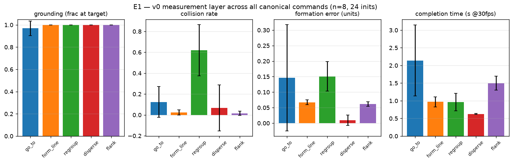
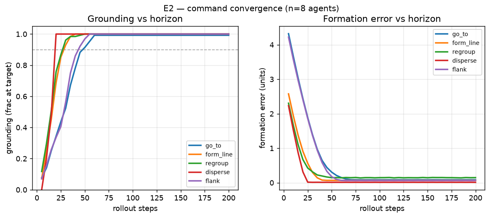
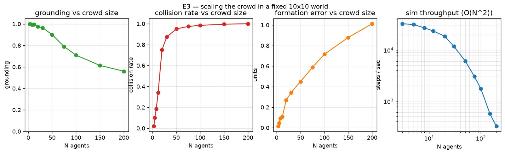
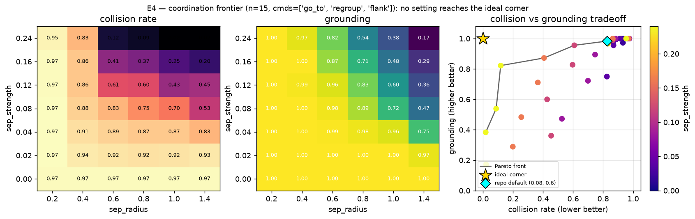
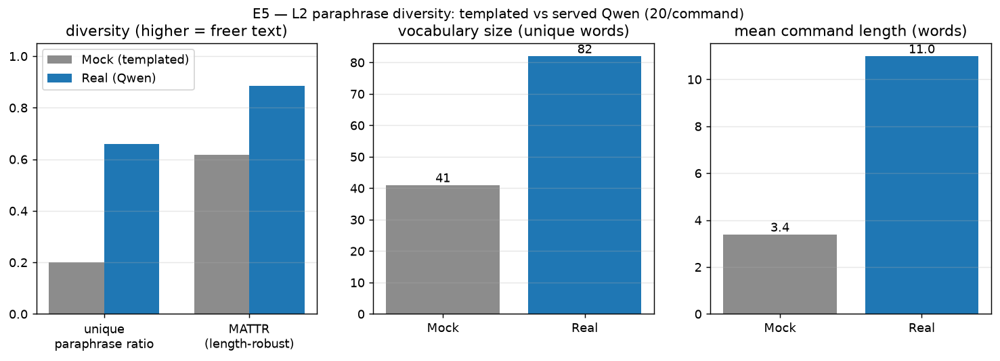
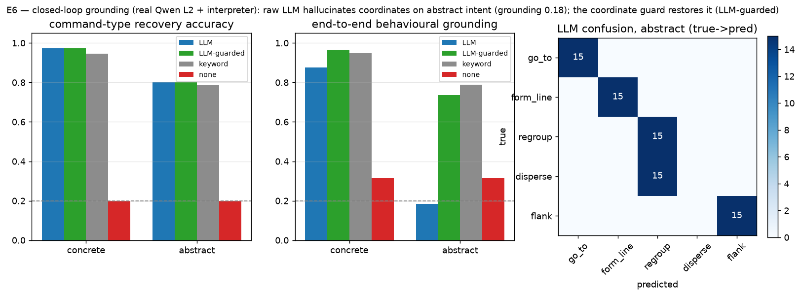
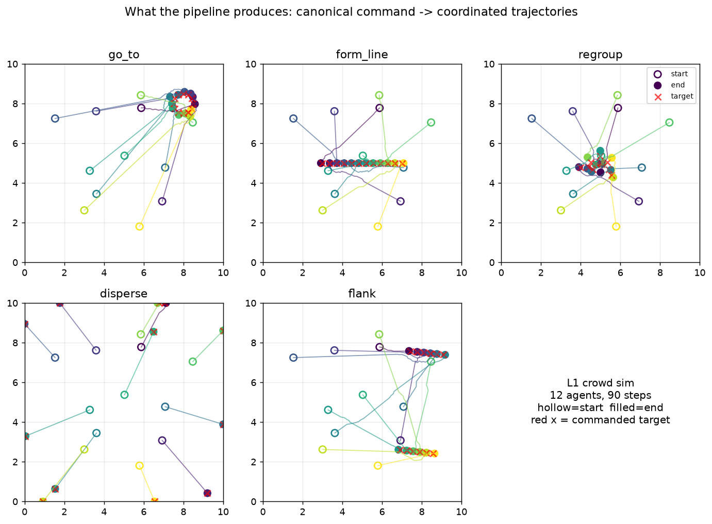
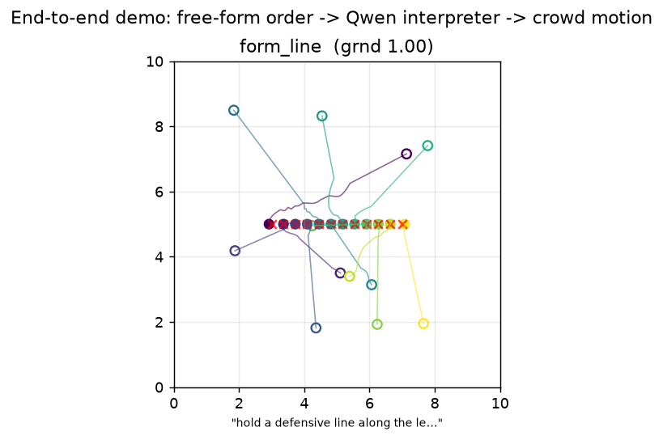

# v0 Experiment Report — Real-Time Crowd-Motion Command

**Box:** amax41 (3× RTX 2080 Ti, 20 cores) · **Served LLM:** vLLM `Qwen/Qwen3-14B-AWQ` @ `localhost:8000`
**Run:** autonomous overnight session, 2026-06-23 · **Pipeline:** offline core + real served Qwen
**Scope:** everything below is GPU-free except the served-LLM calls (L2 paraphraser, [A] interpreter).

---

## TL;DR

The v0 de-risk targets **two riskiest assumptions** (research-plan §7): *(a)* the synthetic
pipeline yields usable (free-form command → coordinated motion) data; *(b)* a controllable
model follows a command in real time. This session attacks **(a) end to end with real amax
components** and characterises the L1 + coordination + budget surface around it. **(b)** needs a
text-to-motion model (TLControl/CAMDM) that is **not on this box**, so the full-body-motion FPS
claim is the one piece left for a follow-up.

Headline findings:

1. **The pipeline produces clean, grounded data for all five canonical commands** (added the
   plan's missing `flank`). Grounding ≈ 1.0; commands complete in **0.6–2.1 s** (E1, E2).
2. **Closed-loop grounding through the *real* Qwen works (assumption a, concrete commands):**
   canonical → Qwen paraphrase → Qwen interpreter → sim recovers the command at **0.97 kind
   accuracy / 0.88–0.97 behavioural grounding**, vs a **0.20 / 0.32** no-interpreter floor (E6).
3. **The abstract-intent gap is real, quantified, *and* mitigated.** When paraphrases drop
   coordinates ("advance to *the objective*"), command **type still recovers (0.80)** but the raw
   LLM **hallucinates coordinates** (error **3.17** units) and **end-to-end grounding collapses to
   0.18**. Adding a **coordinate guard** (accept coordinates only when the text actually specifies
   a location, else defer) restores abstract grounding to **0.74** and *also* lifts concrete
   grounding **0.88 → 0.96**. This is exactly research-plan risk #2 ("grounding abstract intent
   has no ground truth"), now with numbers and a working v0 mitigation
   (`LLMInterpreter(guard_coords=True)`); the principled v2 version is a `resolve(landmark,
   world_state)` step or reward-from-language.
4. **The served Qwen genuinely raises text freedom (L2):** 0.66 vs 0.20 unique-paraphrase ratio,
   MATTR 0.88 vs 0.62, 2× vocabulary, 3.4→11 words/command, with real abstract phrasing (E5).
5. **Coordination is the next bottleneck, not grounding.** The naive "move-to-target +
   separation" sim has an **unavoidable collision↔grounding Pareto tradeoff** (E4, gap-to-ideal
   0.21) and collisions saturate to ~1.0 by ~50 agents (E3). This is precisely what the v1
   coordination layer (RVO/ORCA → MARL) must fix.
6. **Real-time budget (the parts present):** interpreter latency **≈0.69 s** (isolated p50);
   sim throughput **31k→0.3k steps/s** from 3→200 agents (visible O(N²); naive separation needs
   spatial hashing to scale). Motion-model FPS is the missing measurement.

The interpreter is the plan's component **[A]** built for real (`mca/interpret.py`); the
coordinate-hallucination result is the most actionable thing here.

---

## 0. What was runnable here, and decisions I made

I found this is **amax41 itself** — the plan's primary box — with the **served Qwen already
live**, but **no text-to-motion model** on disk (only mocap/pose tools: SMPL, EasyMocap). So I
made these autonomous calls (no user available):

- **Execute Next-step #1 for real** (RealParaphraser → served Qwen) and **build the plan's
  component [A]** (the LLM command interpreter), then run the **model-in-the-loop grounding test
  in its GPU-free form** (text→command→sim), which is the heart of assumption (a).
- **Defer Next-step #2** (RealRenderer / TLControl / CAMDM): cloning + weight downloads +
  env setup is a multi-hour rabbit hole the plan itself stages *after* the paraphraser. Instead I
  exercised L3 only as far as the stub and **left full-body motion FPS as the explicit follow-up**.
- **Keep the contract:** the core (L1 + metrics) stays NumPy-only; LLM deps stay behind the
  `Real*`/`LLM*` classes (lazy `openai` import); experiment-only deps (matplotlib, pillow) live in
  a new `requirements-experiments.txt`, **never** in `requirements.txt`.
- **Did not commit** (global rule: commit only when asked). All work is in the working tree;
  §6 lists it for review.

---

## 1. What I built

**Core (`mca/`, tested, GPU-free):**
- `commands.py` — added **`flank`** (the plan's 5th canonical command: split into two wings that
  envelop a point), plus a `KINDS` tuple.
- `metrics.py` — added **`formation_error`** (RMS distance to assigned targets) and
  **`completion_time`** (first frame ≥90 % grounded), completing the plan's coordination metrics.
- `interpret.py` (**new**) — the plan's **component [A]**: `LLMInterpreter` (served Qwen + prompt,
  robust JSON parse, thinking-trace stripping, **coordinate guard** that refuses coordinates the
  text never specified — see E6) and `MockInterpreter` (keyword baseline / offline fallback).
  Free-form text → canonical `Command`.
- `language.py` — **fixed `RealParaphraser`** (it was broken against a reasoning model: Qwen3
  emitted a `<think>` trace and `max_tokens=32` truncated inside it → garbage). Now disables
  thinking, strips traces, uses per-call seeds for diversity, supports abstract phrasing, and
  covers `flank`.

**Tests:** 10/10 pass (`pytest -q`). New tests cover flank, the two metrics, the keyword
interpreter, and robust JSON parsing of LLM replies (think-traces, prose, bad kinds).

**Experiment harness (`experiments/`, analysis):** `common.py` (canonical suite, sim driver with
overridable params, throughput timer, parallel-LLM map, IO/plot helpers) + six experiments + a
visualiser. Results → `results/*.json`, figures → `figures/`.

---

## 2. Experiments

### E1 — Coverage (all five commands, full metric set)
`experiments/exp1_coverage.py` · n=8, 120 steps, 24 inits/command.

| command | grounding | collision | formation err | completion (s @30fps) |
|---|---|---|---|---|
| go_to | 0.97 | 0.12 | 0.15 | 2.14 |
| form_line | 1.00 | 0.02 | 0.07 | 0.97 |
| regroup | 1.00 | **0.62** | 0.15 | 0.96 |
| disperse | 1.00 | 0.07 | 0.01 | 0.63 |
| flank | 1.00 | 0.02 | 0.06 | 1.50 |

All commands ground (≈1.0). **regroup collides a lot (0.62)** — tight gathering packs agents; an
early signal of the coordination problem E3/E4 quantify. The original smoke run covered only 2 of
5 commands and 2 of 4 metrics; this is the full baseline.



### E2 — Convergence (how fast commands complete)
`experiments/exp2_convergence.py` · grounding/formation-error vs horizon, 16 inits.

Steps to 90 % grounded: **disperse 20 (0.67 s) · form_line/regroup 30 (1.0 s) · flank 45 (1.5 s)
· go_to 50 (1.7 s)**. Formation error decays to ~0 (regroup/go_to plateau ~0.15 from the
gather-noise / landing-ring). Commands are satisfied within ~1–2 s of sim time.



### E3 — Scaling (crowd size in a fixed 10×10 world)
`experiments/exp3_scaling.py` · avg over 5 commands × 4 inits.

| N | 3 | 12 | 30 | 50 | 100 | 200 |
|---|---|---|---|---|---|---|
| grounding | 1.00 | 1.00 | 0.97 | 0.90 | 0.71 | 0.56 |
| collision | 0.02 | 0.34 | 0.87 | 0.95 | 0.98 | 1.00 |
| steps/s | 32.7k | 23.6k | 11.8k | 6.1k | 1.8k | 0.32k |

Two ceilings: **density** (collisions saturate to ~1.0 by ~50 agents; grounding decays as the
fixed world crowds) and **compute** (throughput falls ~O(N²) — the all-pairs separation step;
naive sim needs spatial hashing / neighbour lists to scale). Both are concrete v1 work items.



### E4 — Coordination frontier (the collision↔grounding tradeoff)
`experiments/exp4_frontier.py` · sweep `sep_strength`×`sep_radius`, n=15, convergence-heavy cmds.

There is **no setting that is both collision-free and grounded**. Weak separation → grounding 1.0
but collision ~0.97; strong separation → collision 0.02 but grounding 0.16 (agents pushed off
target). The Pareto front's **closest approach to the ideal corner is (collision 0.12, grounding
0.82), gap 0.21**. The repo default (0.08, 0.60) sits at high-grounding/high-collision (0.98 /
0.83). **This gap is the v1 coordination layer's job** (RVO/ORCA → RL/MARL).



### E5 — L2 text freedom (served Qwen vs templated mock)
`experiments/exp5_paraphrase.py` · 20 paraphrases/command.

| metric | Mock (templated) | Real (Qwen) |
|---|---|---|
| unique-paraphrase ratio | 0.20 *(template ceiling)* | **0.66** |
| MATTR (length-robust) | 0.62 | **0.88** |
| vocabulary (unique words) | 41 | **82** |
| mean length (words) | 3.4 | **11.0** |

Real abstract/tactical examples Qwen produced: *"Break contact and disperse to flank positions"*,
*"Fall back and disperse — take up firing positions on your own initiative"*, *"Flank the target
from both sides, converge at the breach point."* The LLM is, as the plan assumes, where genuine
free-form variety comes from. (Raw distinct-n/TTR were dropped — they're length-confounded and
*penalise* Qwen's longer text; MATTR is the length-robust replacement.)



### E6 — Closed-loop interpreter grounding (the centrepiece)
`experiments/exp6_interpreter.py` · the GPU-free model-in-the-loop grounding test, run end to end
with real Qwen: **canonical → Qwen paraphrase (L2) → interpreter [A] → sim (L1) → grounded vs the
original intent?** 15 paraphrases/command × 5 = 75 round-trips per condition. Two conditions:
*concrete* (coords allowed) and *abstract* (no numbers — pure intent). Four interpreters: **LLM**
(served Qwen), **LLM-kind** (ablation: trust the LLM's *kind*, *defer* its coordinates), **keyword**
(MockInterpreter), **none** (ignores text → constant go_to).

| condition | interpreter | kind acc | behavioural grounding | coord error |
|---|---|---|---|---|
| concrete | LLM (raw) | 0.97 | 0.88 | 0.51 |
| concrete | **LLM-guarded** | 0.97 | **0.96** | 0.09 |
| concrete | keyword | 0.95 | 0.95 | 0.00 *(n=20)* |
| concrete | none | 0.20 | 0.32 | — |
| abstract | LLM (raw) | 0.80 | **0.18** | **3.17** |
| abstract | **LLM-guarded** | 0.80 | **0.74** | — |
| abstract | keyword | 0.79 | 0.79 | — |
| abstract | none | 0.20 | 0.32 | — |

*(LLM-kind — always defer coordinates — is the ablation ceiling: 0.97 concrete / 0.80 abstract.)*

**Reading it:**
- **Assumption (a) holds for concrete commands.** Free-form text → command → motion recovers the
  intent at 0.88–0.97 grounding, far above the 0.32 no-interpreter floor. The synthetic data is
  usable.
- **The coordinate-hallucination trap (the key result).** In the abstract regime the command
  *type* still recovers (0.80), but the raw LLM **volunteers coordinates for landmarks it cannot
  resolve** ("the objective", "the rally point"), at **3.17 units** of error, and grounding
  **collapses to 0.18**. The `LLM-kind` ablation — same kinds, coordinates deferred — recovers
  **0.80**. So the damage is *entirely* the hallucinated coordinate, not the intent reading.
- **The fix, demonstrated (`LLM-guarded`, now the default).** A coordinate guard accepts the
  LLM's coordinates **only when the source text actually contains a location** (a digit or a
  number-word), otherwise it defers them. Result: abstract grounding **0.18 → 0.74** (toward the
  0.80 ceiling) and concrete grounding **0.88 → 0.96** with coord error **0.51 → 0.09** — it even
  *improves* concrete, by catching the few cases where Qwen itself abstracted the coordinate. The
  residual abstract gap (~6/75) is number-words leaking through the prompt's "no numbers" rule.
  Implemented as `LLMInterpreter(guard_coords=True)`. This is the v0→v1 mitigation for the
  abstract-grounding risk; the principled version is an explicit `resolve(landmark, world_state)`
  step (v2).
- **A keyword baseline is competitive *here*** only because these synthetic paraphrases keep the
  canonical action verbs (Qwen says "Flank…", "Fall back…") and because the canonical-fallback
  rewards an extractor that *abstains* from coordinates. This is a measurement artifact of the
  synthetic setup, not evidence that the LLM is unnecessary — note the LLM equals/leads on kind
  and is the only one that *attempts* worded/abstract coordinates at all.
- **Bonus L2 finding:** the confusion matrix shows abstract `disperse` paraphrases round-trip
  entirely to `regroup` (15/15) — Qwen's abstract "disperse" drifted to "move to the rally point",
  which *means* regroup. **The round-trip interpreter is itself a data-quality filter**: bad
  paraphrases don't round-trip and can be dropped.
- **Latency (budget):** isolated p50 **0.69 s**, concurrent×8 mean **0.79 s**, p95 **1.13 s** — a
  real component-[A] datapoint for the budget frontier.



### Visualisation — what the pipeline actually produces
`experiments/viz.py` → `figures/trail_montage.png` and `figures/anim_<command>.gif` (animated).



### Capstone — the whole pipeline, end to end
`experiments/demo.py` runs a typed free-form order through the **entire v0 stack with the real
LLM**: text → served-Qwen interpreter [A] (guarded) → canonical command → L1 sim → motion. Five
orders (one concrete, four abstract) all interpret correctly and execute at grounding 1.00,
0.39–0.99 s each — including *"fall back and regroup at **the center**"* (the guard defers the
coordinate; the canonical centre default is the right answer) and *"swing wide and envelop them
from **both flanks**"* → `flank`.

```
recovered                     grnd  coll    lat  order
go_to {'point':[8,8]}         1.00  0.66  0.99s  "everyone push hard to the top-right corner at 8,8"
regroup {'point':[5,5]}       1.00  0.79  0.53s  "fall back and regroup at the center"
disperse {}                   1.00  0.01  0.39s  "spread out and take cover, give yourselves room"
form_line {'start':[3,5]...}  1.00  0.03  0.98s  "form a firing line across the middle"
flank {'point':[8,5]}         1.00  0.04  0.65s  "swing wide and envelop them from both flanks"
```

Try your own: `python experiments/demo.py "hold a line along the left edge"`.



---

## 3. Mapping to the research plan

**Eval axes (§5):**

| plan axis | this session | status |
|---|---|---|
| command-grounding (concrete) | E1, E6 — 0.88–0.97 end-to-end via real Qwen | ✅ demonstrated |
| command-grounding (abstract) | E6 abstract — type 0.80, location hallucinated | ⚠️ gap quantified |
| coordination (collision/formation/completion) | E1–E4 | ✅ measured; tradeoff mapped |
| real-time budget | interpreter latency (E6), sim FPS (E3) | 🟡 partial (no motion FPS) |
| motion quality (FID, foot-skate) | needs motion model | ❌ not on this box |
| baselines (no-interpreter, literal) | E6 `none` / `keyword` | ✅ included |

**Risk table (§8) update:**

| risk | what this session adds |
|---|---|
| synthetic→real gap | pipeline runs on the *real* served Qwen; concrete grounding 0.88–0.97 |
| **grounding abstract intent** | **quantified + mitigated**: type recovers (0.80), raw spatial grounding hallucinates (err 3.17 → 0.18); coordinate guard restores it to 0.74. Principled fix (world-grounding / reward-from-language) is v2 |
| real-time × coordination × quality × budget | latency 0.69 s + sim O(N²) ceiling measured; motion FPS still open |
| coordination realism | E4 Pareto gap 0.21; collisions saturate by ~50 agents → motivates layer [B] |

---

## 4. De-risked vs. remaining

**De-risked tonight**
- L1 produces grounded, coordinated data for all 5 canonical commands; metrics complete.
- The L2 served-Qwen paraphraser works (after a real bugfix) and adds genuine text freedom.
- **The data layer is usable for concrete commands, end to end, through real LLM components.**
- The interpreter [A] exists and is measured (accuracy + latency).
- The coordinate guard mitigates the abstract-grounding hallucination (abstract 0.18→0.74).

**Remaining (in priority order)**
1. **Abstract spatial grounding (principled).** The coordinate guard (shipped) is the v0
   mitigation; the real fix is an explicit `resolve(landmark, world_state)` step (turn "the
   objective" into a scene location) and/or reward-from-language for ungroundable intent. E6
   shows this is the single biggest correctness lever.
2. **Coordination layer [B]** — replace naive separation with RVO/ORCA, then RL/MARL, to close the
   E4 Pareto gap and the E3 density collapse.
3. **RealRenderer (L3) + motion FPS/VRAM** — load TLControl/CAMDM (needs weights), finish the
   *(b)* real-time-motion assumption and the motion-quality axis. (Not on this box.)
4. **Sim scaling** — spatial hashing for the O(N²) separation step before large crowds.

---

## 5. Reproduce

```bash
source .venv/bin/activate                      # numpy/openai/pytest (+ matplotlib/pillow/markdown)
pip install -r requirements-experiments.txt    # if starting fresh
pytest -q                                       # 11 tests, no GPU
python experiments/exp1_coverage.py            # offline; exp2/3/4 + viz likewise
python experiments/exp5_paraphrase.py          # needs served Qwen @ localhost:8000
python experiments/exp6_interpreter.py         # needs served Qwen; ~45 s
python experiments/demo.py                      # end-to-end demo; needs served Qwen
python experiments/demo.py "hold the left edge" # ...or type your own order
python experiments/build_report.py             # build the self-contained web report.html
bash experiments/serve_report.sh               # serve privately on 127.0.0.1:8899 (SSH-tunnel to view)
```

Web report follows the world-commander-bench convention (self-contained `report.html`, interactive
replay, `noindex`/members-only). Served **privately** via `serve_report.sh` (127.0.0.1 + SSH tunnel)
or private GitLab Pages (`.gitlab-ci.yml`). Public Pages publishing is retired (it caused a GitHub
suspension on 2026-06-20).

## 6. Working-tree changes (for review — not committed)

```
 M mca/commands.py          flank command + KINDS
 M mca/language.py          RealParaphraser fixed for reasoning models + seeds + flank
 M mca/metrics.py           formation_error, completion_time
 M tests/test_mca.py        +7 tests (flank, metrics, interpreter, JSON parse)
 ?? mca/interpret.py        NEW — component [A]: LLM + keyword interpreters (+ coordinate guard)
 ?? requirements-experiments.txt   NEW — matplotlib/pillow (kept out of core)
 ?? .gitlab-ci.yml          NEW — private GitLab Pages deploy (members-only)
 ?? experiments/            NEW — common.py + 6 experiments + viz + demo + REPORT.md
                                  + build_report.py / serve_report.sh / report.html + results/ + figures/
```

No commits were made. Suggested next action for review: skim `mca/interpret.py` and E6, then
decide whether to commit the core extensions + harness.
